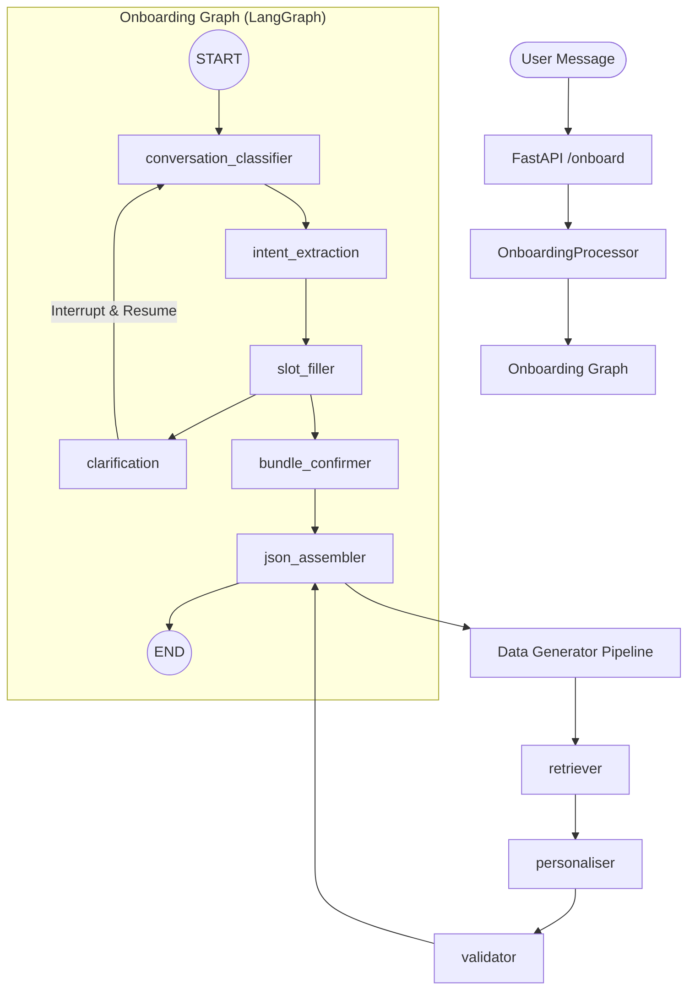

# Data Flow Architecture — AI Architect

This document explains how information is processed and passed between nodes, agents, and services in the AI Architect system.

## 1. High-Level Architecture

The system is built as a state-driven pipeline using **LangGraph** for orchestration and **FastAPI** for the API layer. Information flows from a user message through a series of specialized nodes that enrich a shared state, eventually producing validated workspace configuration and dummy data.

## 2. Shared State: `OnboardingState`

All nodes communicate by reading from and writing to a central `OnboardingState` object. This ensures data consistency across the pipeline.

| Key                  | Description                                                             |
| -------------------- | ----------------------------------------------------------------------- |
| `messages`           | Historical conversation history (LangGraph `MessagesState`).            |
| `slots`              | Extracted variables (e.g., `team_size`, `industry_hint`).               |
| `onboarding_intents` | Structured classification of user intent and bundle choice.             |
| `turn_count`         | Track how many interactions have occurred.                              |
| `confirmed`          | Boolean flag indicating if the user has approved the bundle suggestion. |
| `generation_json`    | Final backend configuration payload.                                    |
| `dummy_data_json`    | Final realistic sample data payload.                                    |

## 3. Node-by-Node Data Processing

### 1. `conversation_classifier`

- **Input**: Latest user message from `messages`.
- **Action**: Uses GPT-4 to classify the "turn" (e.g., is this a new request? An answer to a question? A confirmation?).
- **Output**: Updates `turn_count` and routes to the next node (e.g., `intent_extraction` or `slot_filler`).

### 2. `intent_extraction`

- **Input**: User message + `BundleCatalog` context.
- **Action**: Extracts the `bundle` key (e.g., `hr_hub`), the `entity_type` (e.g., `people`), and initial `industry_hint`.
- **Output**: Updates `onboarding_intents` and pre-fills `slots`. Routes to `slot_filler`.

### 3. `slot_filler`

- **Input**: `onboarding_intents` + `slots` + `BundleCatalog`.
- **Action**: Compares filled `slots` against the `required_slots` for the selected bundle. If a slot was just answered (via `clarification_queue`), it parses the value.
- **Output**: If slots are missing, updates `clarification_queue` and routes to `clarification`. If all filled, routes to `bundle_confirmer`.

### 4. `clarification` (Human-in-the-Loop)

- **Action**: Generates a conversational question for the next missing slot and **interrupts** the graph.
- **Data Passing**: The user's response is injected back into `messages` by the `Processor.reply()` method when the graph resumes.

### 5. `json_assembler`

- **Input**: Finalized `slots` and `onboarding_intents`.
- **Action**: Triggers the **Data Generator Pipeline**.
  1. **Retriever**: Fetches Markdown templates from Pinecone (Fetch -> Search -> Fallback).
  2. **Personaliser**: Merges templates and uses LLM to replace `{{placeholders}}` with `slots` data.
  3. **Validator**: Ensures the resulting JSON matches the expected schema and includes all required modules.
- **Output**: Final `generation_json` and `dummy_data_json` stored in state.

## 4. Verification of Correctness

Based on the `IMPLEMENTATION_INSTRUCTIONS.md`, the data flow is implemented **correctly and consistently**:

1. **State Management**: Uses the `OnboardingState` pattern and `MessagesState` extension as specified.
2. **Orchestration**: Correctly implements the `interrupt/resume` lifecycle in `processor.py`, critical for Human-in-the-Loop clarification nodes.
3. **Data Generator**: The 3-strategy fallback in the retriever and structured output personalisation follow Phase 2 requirements exactly.
4. **Async/Settings**: Every node uses `get_openai_chat_model` and `get_settings`, adhering to the centralized config and async-only rules.

> **Note**: The data handoff between `slot_filler` and `clarification` is particularly robust because it uses a queue system (`clarification_queue`), preventing the LLM from asking for the same information twice.
